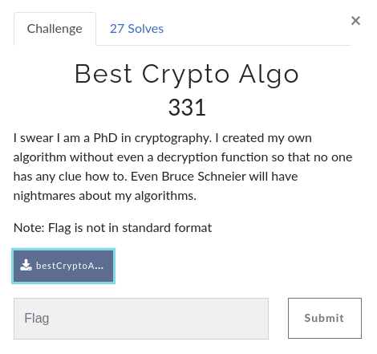

# CsecIITB CTF 2020

## Category: Crypto

## Challenge: Best Crypto Algo



Someone is rolling their own crypto again!!! Let's beat their ***** :P

```python
from math import floor,sqrt
from random import randint as rand
str = 'S7rinG_t0_b3_enCRYpt3D';

dec_array=[]
for i in range(len(str)):
    dec_array.append(ord(str[i]))

maxval=max(dec_array)
key=rand(10,maxval)
key=key*101
for i in range(len(str)):
    x=dec_array[i]
    am=(key+x)/2
    gm=sqrt(key*x)
    enc=am+gm
    print(floor(enc)%255,end=" ")

#153 33 113 45 118 185 228 27 33 51 252 236 90 252 160 252 33 27 85 252 176 33 106 139 228 101 252 33 179 176 33 106 252 236 123 160 68 62 33 99 236 79 123
```

Take the string, find the character with the largest ascii value, choose a random key from 10 to that value, and multiply it 101. Take a character `x` at `i`th index from the string, compute `[(sqrt(key)+sqrt(x))^2]/2` and this value modulo 255 is the `i`th index of the ciphertext.

Notice that we can assume that our characters are ASCII printables, and would be mostly uppercase, lowercase, digits or underscore probably. So our maxval can be at max 122. Therefore, our key is in the range `101*10` to `101*122`. Since these are really small values, we can bruteforce the key as well as the characters. My script can be checked out [here](solve_crypto.py).

```python
from math import floor,sqrt
from string import printable
s = '153 33 113 45 118 185 228 27 33 51 252 236 90 252 160 252 33 27 85 252 176 33 106 139 228 101 252 33 179 176 33 106 252 236 123 160 68 62 33 99 236 79 123'
l = [int(i) for i in s.split()]

def get_poss_values(key,oup) :
    l = []
    for x in range(key+1):
        if chr(x) not in printable:
            continue
        am=(key+x)/2
        gm=sqrt(key*x)
        if (oup == floor(am+gm)%255):
            l.append(x)
    return l

for key in range(101*10,101*122+1):
    op = []
    ans = True
    for x in l:
        val = get_poss_values(key,x)
        if len(val) == 0:
            ans = False
            break
        else:
            op.append(val)
    if (ans):
        print(key,op)
```

The output is - `10706 [[39, 73], [95], [67], [97], [110], [78], [48], [55], [95], [98], [51], [49], [105], [51], [74, 118], [51], [95], [55], [63, 104], [51], [121], [95], [66], [114], [48], [107], [51], [95], [42, 77], [121], [95], [66], [51], [49], [111], [74, 118], [101], [100], [95], [65], [49], [103], [111]]`

We got the key uniquely, and most characters have been uniquely determined, let's try all combinations now -

```python
key = 10706//101
l = [[39, 73], [95], [67], [97], [110], [78], [48], [55], [95], [98], [51], [49], [105], [51], [74, 118], [51], [95], [55], [63, 104], [51], [121], [95], [66], [114], [48], [107], [51], [95], [42, 77], [121], [95], [66], [51], [49], [111], [74, 118], [101], [100], [95], [65], [49], [103], [111]]

ops = ['']
for i in l:
    ops2 = []
    for x in ops:
        for v in i:
            ops2.append(x+chr(v))
    ops = ops2
print(ops)
```

We get -

```
["'_CanN07_b31i3J3_7?3y_Br0k3_*y_B31oJed_A1go", "'_CanN07_b31i3J3_7?3y_Br0k3_*y_B31oved_A1go", "'_CanN07_b31i3J3_7?3y_Br0k3_My_B31oJed_A1go", "'_CanN07_b31i3J3_7?3y_Br0k3_My_B31oved_A1go", "'_CanN07_b31i3J3_7h3y_Br0k3_*y_B31oJed_A1go", "'_CanN07_b31i3J3_7h3y_Br0k3_*y_B31oved_A1go", "'_CanN07_b31i3J3_7h3y_Br0k3_My_B31oJed_A1go", "'_CanN07_b31i3J3_7h3y_Br0k3_My_B31oved_A1go", "'_CanN07_b31i3v3_7?3y_Br0k3_*y_B31oJed_A1go", "'_CanN07_b31i3v3_7?3y_Br0k3_*y_B31oved_A1go", "'_CanN07_b31i3v3_7?3y_Br0k3_My_B31oJed_A1go", "'_CanN07_b31i3v3_7?3y_Br0k3_My_B31oved_A1go", "'_CanN07_b31i3v3_7h3y_Br0k3_*y_B31oJed_A1go", "'_CanN07_b31i3v3_7h3y_Br0k3_*y_B31oved_A1go", "'_CanN07_b31i3v3_7h3y_Br0k3_My_B31oJed_A1go", "'_CanN07_b31i3v3_7h3y_Br0k3_My_B31oved_A1go", 'I_CanN07_b31i3J3_7?3y_Br0k3_*y_B31oJed_A1go', 'I_CanN07_b31i3J3_7?3y_Br0k3_*y_B31oved_A1go', 'I_CanN07_b31i3J3_7?3y_Br0k3_My_B31oJed_A1go', 'I_CanN07_b31i3J3_7?3y_Br0k3_My_B31oved_A1go', 'I_CanN07_b31i3J3_7h3y_Br0k3_*y_B31oJed_A1go', 'I_CanN07_b31i3J3_7h3y_Br0k3_*y_B31oved_A1go', 'I_CanN07_b31i3J3_7h3y_Br0k3_My_B31oJed_A1go', 'I_CanN07_b31i3J3_7h3y_Br0k3_My_B31oved_A1go', 'I_CanN07_b31i3v3_7?3y_Br0k3_*y_B31oJed_A1go', 'I_CanN07_b31i3v3_7?3y_Br0k3_*y_B31oved_A1go', 'I_CanN07_b31i3v3_7?3y_Br0k3_My_B31oJed_A1go', 'I_CanN07_b31i3v3_7?3y_Br0k3_My_B31oved_A1go', 'I_CanN07_b31i3v3_7h3y_Br0k3_*y_B31oJed_A1go', 'I_CanN07_b31i3v3_7h3y_Br0k3_*y_B31oved_A1go', 'I_CanN07_b31i3v3_7h3y_Br0k3_My_B31oJed_A1go', 'I_CanN07_b31i3v3_7h3y_Br0k3_My_B31oved_A1go']
```

Hope you got the flag - `I_CanN07_b31i3v3_7h3y_Br0k3_My_B31oved_A1go`.
