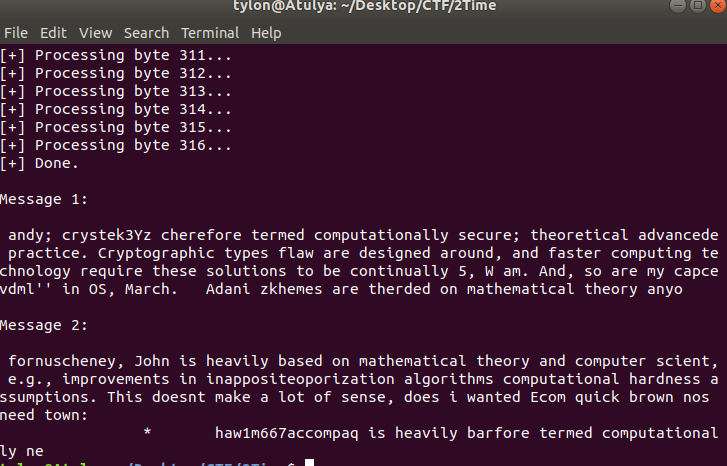
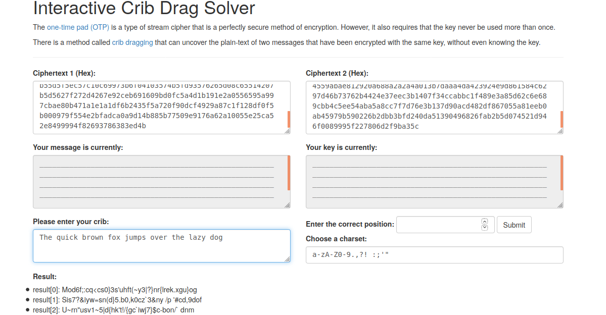
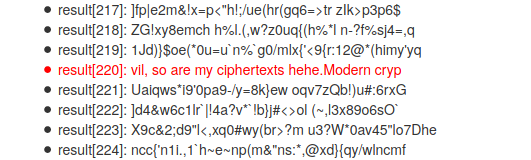

# CsecIITB CTF 2020
## Category: Crypto
## Challenge: OTP

### Idea: 

The question requires you to find some string (flag) in a bunch of cipher text. Clearly the cipher texts do not make much sense at first glance. Its actually
encrypted using OTP in which the message is XOR'ed with some key of the same length, except in this challenge all the messages have been XOR'ed with the
same key (also known as Two Time Pad). There are ways to get back the message in these cases. One way, the one I'll be using, is called crib dragging. Lets get some terms straight. Call two messages as m1 and m2, the key as k (same length as message), and c1 and c2 as their corresponding ciphertexts. 
So c1= m1 xor k and c2= m2 xor k. Now if you XOR the two cipher texts, you'll get m3= c1 xor c2= m1 xor k xor m2 xor k = m1 xor m2. This is where crib dragging comes to use. In order to make guesses of what m1 and m2 might contain, we actually used a [project](https://github.com/MrBhendel/2Time) that deals with this 
problem using some Natural Language Processing appraoch. For it to work, you'll have to provide it with a large enough corpus. I used [this](http://www.cs.cmu.edu/~enron/) as the corpus. When you give this program the xor of two strings, it outputs what the two strings could have been. Although I didn't get exact results from it, I got many words that were actually present, so much so that I got the entire key (using crib dragging) using just two of the 9 messages.
When you load the corpus (which takes a good amount of time for the datasets mentioned above) in program (as described in the github page of the project) and when you give it the XOR of message 1 and 3, it outputs something like this:

Notice that there are some discernable words like "termed computationally secure", "Cryptographic", "and faster computing technology", "require these solutions to be continually", "is heavily based on mathematical theory and computer", computational hardness assumption", "quick brown", and so on. When you use these phrases for crib dragging, you'll get some more phrases that makes sense. This also requires some guess work, for e.g., notice the phrase "quick brown", so I guessed it would have something like "The quick brown fox jumps over the lazy dog", and it actually worked. Here's some screenshots:

Notice that on position 220, I actually got a hit. Similarly keep adding phrases from that output, and guess what makes sense until you actually get one of the messages. Once that happens, just XOR it with its corresponding ciphertext to get the key. The flag will be in the 5th ciphertext.

Used [this](https://lzutao.github.io/cribdrag/) tool for crib dragging.

*Flag*
> 7h3_OTP_h45_b33n_br34ch3d_I_repeat_MTP_is_br34ch3d

