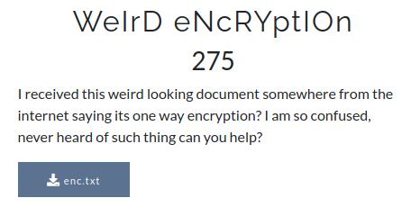

# CsecIITB CTF 2020
## Category: Crypto
## Challenge: Weird Encryption

### Idea: 

The text file contains encryptions of three different length i.e. 32, 40, 64. Length 32 is md5 encrypted, 40 is sha1 encrypted and 64 is sha256 encrypted. Just fed them to respective decrypting platform and get the result. I used the following for it [md5](https://md5decrypt.net/en/), [sha1](https://md5decrypt.net/en/Sha1/) and [sha256](https://md5decrypt.net/en/Sha256/).

*Flag :*
> H@5hin6_mY_wAy_0u7_tO_r3a11y_bizarr3_id3as_oF_qu35710n5