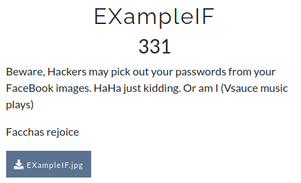

# CsecIITB CTF 2020
## Category: Forensics
## Challenge: EXampleIF
## Points: 500
### Description:

Image available in repo.

### Idea:
This is an easy problem. We have and image and need a flag just see if there is something encoded.

Using [Forensically Beta](https://29a.ch/photo-forensics/) and seeing the string extraction data we get our flag.
Facchas rejoice.
*Flag :*
> CsecIITB{3l1t3_3x1f_4uth0r1ty_dud3}