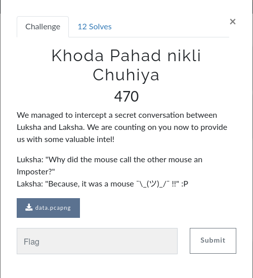
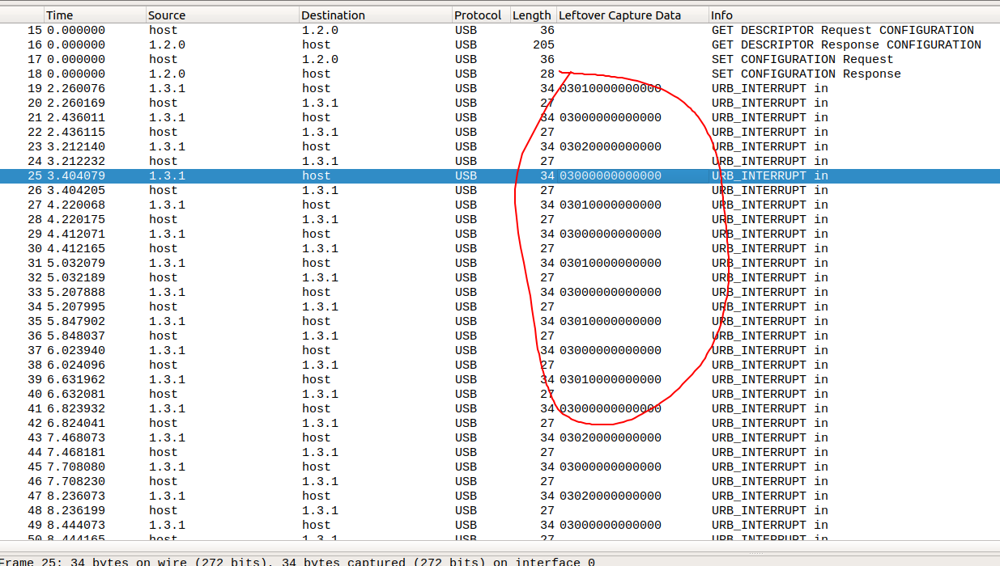

# CsecIITB CTF 2020
## Category: Forensics
## Challenge: Khoda Pahad nikli Chuhiya

### Idea: 

This is a wireshark challenge. When you open the packet capture with wireshark, you should see something like this:

Notice the leftover capture data columns have some alternating 1 and 2 bits among the several exchanges. They are possibly click recorded from some
wireless mouse. You might have understood what to do next already. 
If not, they are supposed to be binary digits. Interpret the 1's as 0 and 2's as 1, and convert the entire leftover capture data for the usb interrupt messages into a stream of binary digits. Partition them into 8 bit, convert to ascii and voila!

[This](https://medium.com/@ali.bawazeeer/kaizen-ctf-2018-reverse-engineer-usb-keystrok-from-pcap-file-2412351679f4) site should help you through the process. It's for a similar challenge, except keyboard strokes were recorded in them. 

*Flag*
> CsecIITB{WiR3leSS_M0us3}

