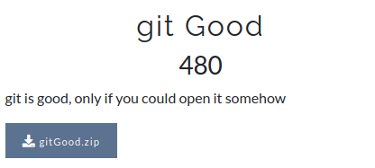

# CsecIITB CTF 2020
## Category: Forensics
## Challenge: gitGood
## Points: 500
### Description:

Zip available in repo.

### Idea:
The zip is password protected. There is a file `flag.txt` and `.git` folder in it. One first glance it appears that the flag will be in any of the version of the `flag.txt`.

We used `John the Ripper` to crack the password. The password was `sweetpotato`. On extracting the file, just do `git log` to see the
versions of the file. You will found only two commits. `git checkout` to last commit. Check the file your flag is there.

*Flag :*
> CsecIITB{git_Good_GeT_Be77er}