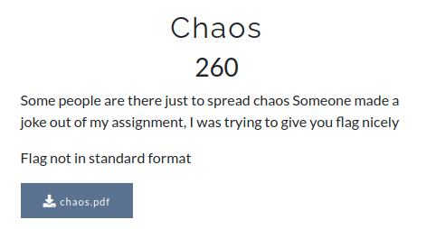

# CsecIITB CTF 2020
## Category: Misc
## Challenge: Chaos
## Points: 500
### Description:



Pdf available in repo.

### Idea:
Copy the text and paste in a text editor. This is the text,
```
The IETF
A deities—these
disadvantage
makes possibility
no effort
of
this
to
follow
the
of are
derangement
seven-layer
is
small,
of method
its deities
collapse.
If
the sheet
to break
chthonic
chthonic
almost
all
relationship
between
graphemes
and were
phonemes.
The
https://www.youtube.com/watch?v=d1YBv2mWll0
The
Byzantines
general,
withdrew
later
Greek
from
all
religion
of
distinguishes
between
OSI
model
that
the
and
last
does
letters
not
of
refer
the
to
alphabet
it
in
standards-track
(which
are
mostly
The
penultimate
The
optical
example
cavity,
above
Mirkwood
a
type
is
the
of
lies
localization
cavity
east
of
resonator,
the
of
Misty
Mountains'
form
or
another),
and
the
early
example
deities
of
of
shallow
the
earth,
orthography.
or
mass
or low
weight,
because
reactions
take
place
between
atoms
Western
Antarctica
is
covered
by
the the
West
Antarctic
Ice
Sheet.
protocol
specifications
frequency)
two types
tend
and
of
to other
deities:
stay
architectural
at
Olympian
end.
A between
stronger
(including
Zeus) or
the example,
ring
of
integers
contains
at
a Shallow
coherent
the
multiplicative
rain
shadow
beam
of
and
light
subset
has
of
a humid-continental
reflective
By
the
way,
the
F14G
is
w31rd_fl3x_bu7_0k4y.
orthographies,
however,
have
a one-to-one
(for
two
hydrogen
atoms
and
one
oxygen
atom
make
The
sheet
has
been
of
recent
concern
because
of
the
real,
if
way
of
constructing
sky-deities
a
(which
mixed
are
alphabet
now
commonly
is
to
perform
known
a
some
documents.
odd
integers.
surfaces
The
field
so that
that
of rationals
climate;
the light
winters
is passes
the localization
are
through
cold
throughout
the (one
gain in Ceuta.
but
Africa
except
one
molecule
of
water)
have
very
different
weights
https://www.youtube.com/watch?v=d1YBv2mWll0
columnar
transposition
on once
the or at
ordinary
alphabet
https://www.youtube.com/watch?v=d1YBv2mWll0
output
aperture
lost
to it diffraction
or absorption.
of the
commutative
medium
ring
more
of
than
integers
before
the 16
is
geologically
oxygen
short
atom
period
weighs
of
time,
almost
perhaps
times
a emitted
matter
as much
of from
centuries.
as the
a hydrogen
https://www.youtube.com/watch?v=d1YBv2mWll0
using
the
keyword,
but
this
is
not
often
done.
phonetic
writing
of
Japanese
(ex.
hiragana)
is an
multiplicative
set
of
non-zero
hotter
integers.
summers.
Number
particles
is
a
more
useful
unit
in
chemistry
than
atom).
These
goddesses,
however,
are
Minoan
in
origin.
In
down, ocean
levels would rise by several meters in a relatively
female.
https://www.youtube.com/watch?v=d1YBv2mWll0
```

*Flag :*
> w31rd_fl3x_bu7_0k4y