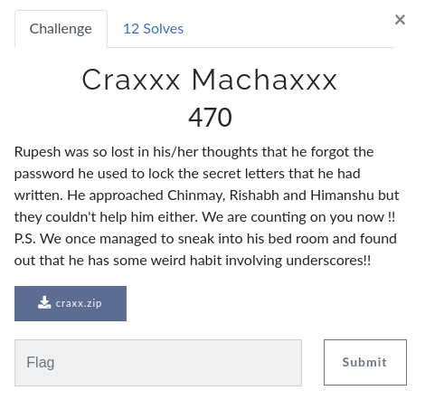

# CsecIITB CTF 2020
## Category: Misc
## Challenge : Craxxx Machaxxx



The [zip](craxx.zip) is password-protected. Using [John The Ripper](https://www.openwall.com/john/), we get the password as `angel123`. Extracting the zip, we find a file named [CsecIITB{saxi_password_needed}.png](CsecIITB%7Bsaxi_password_needed%7D.png) which doesn't open. LOL. 

Use the `file` command on it and you see it's a jpeg file. Rename it and you get an image which has 36 QRs in it. Need to automate stuff :)

That's when one writes a python [script](craxx%20machaxx.py), and you get some output as `['c', ')', 'B{', 'c', '}', 'c', 'e', 'C', 'c', 'e', 'e', ':', 'x', 'e', 'I', 'e', 'h', 'm', 'i', 'I', 'n', 'i', 'r', 'r', 's', 'S', 't', 'u', 'x', 'T', 'Z', 'x', 'xxx', 'Z', 'Z', 'Z']`. Arranging it properly, we have

```python
array([['c', ')', 'B{', 'c', '}', 'c'],
       ['e', 'C', 'c', 'e', 'e', ':'],
       ['x', 'e', 'I', 'e', 'h', 'm'],
       ['i', 'I', 'n', 'i', 'r', 'r'],
       ['s', 'S', 't', 'u', 'x', 'T'],
       ['Z', 'x', 'xxx', 'Z', 'Z', 'Z']], dtype='<U3')
```

Well now what? Did you even binwalk? No? Try now!

```
DECIMAL       HEXADECIMAL     DESCRIPTION
--------------------------------------------------------------------------------
0             0x0             JPEG image data, JFIF standard 1.01
40259         0x9D43          PNG image, 306 x 293, 8-bit/color RGBA, non-interlaced
```

But now how do you get the PNG image from that index? Fire up Python - open, read and write :P

And then you get [this](oup.png) file! Looks like the indices of the characters of flag. Solving manually, one obtains `CsecIITB{SecurintiZcrexxxZmechexxxZ:)Z}`, not the flag though. What's further? Reading up the hint in description, something about underscores! So it seems to me that those Z's are pretty ir-relevant(As is the first word, but whatever). Replace them by underscores and rock and roll buddy!!! The final flag - `CsecIITB{Securinti_crexxx_mechexxx_:)_}`