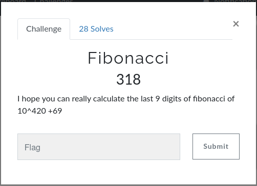

# CsecIITB CTF 2020
## Category: Misc
## Challenge: Fibonacci

### Idea: 

What we need to do is to find fib(10^420+69) mod(10^9), for that we use the fact that for k>=3 last k digits
of fibonacci sequence repeat after ever 15.10^(k-1) terms (Fact 1). So we need to find fib(10^420+69).
Lets call toFind= (10^420+69)%(15*10^8). This can be found easily using modular exponentiation.
toFind comes out to be equal to 1000000069. To find fibonacci of this order we cannot use the linear iterations, so we use
the matrix exponentiation method, which takes O(logn) time.

For Fact 1 click [here](https://math.stackexchange.com/questions/1353119/last-10-digits-of-the-billionth-fibonacci-number),
For modular exponentiation method click [here](http://fusharblog.com/solving-linear-recurrence-for-programming-contest/)

*Flag*
> 614445369

