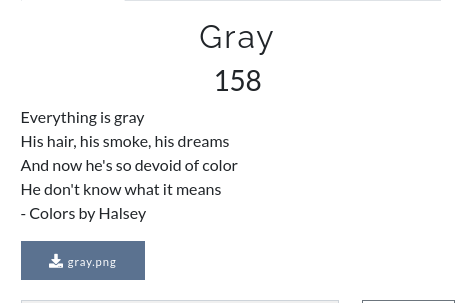

# CsecIITB CTF 2020
## Category: Steganography
## Challenge: Gray
## Points: 500
### Description:

Image available in the repo.

### Idea:
Steganography just go to [Forensically Beta](https://29a.ch/photo-forensics/). There just move the magnifier on it you will found some 
text there. Look carefully you will find your flag.

*Flag :*
> CsecIITB{TAGHeur#Dont_crack_under_pressure_}