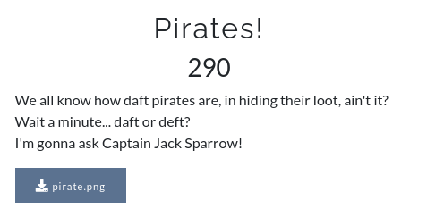

# CsecIITB CTF 2020
## Category: Steganography
## Challenge: Pirates
## Points: 500
### Description:

Image available in repo.

### Idea:
Open the image do you see a qr code. Yes, crop it. No, look closely. Put this qr in some qr reader and get the flag. [Qr Reader](https://www.imgonline.com.ua/eng/scan-qr-bar-code.php) 

*Flag :*
> CsecIITB{iM4g3_In_4N_Im4Ge}