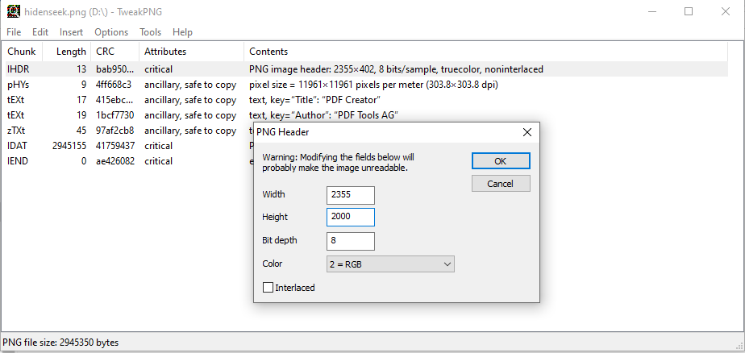

# CsecIITB CTF 2020
## Category: Steganography
## Challenge: Revelation
## Points: 500
### Description:

> Let's play a game of Hide and Seek, shall we? :D [hidenseek.png](https://ctf.cseciitb.in/files/bff9fe32d551abdb975521adf86ef54c/hidenseek.png?token=eyJ1c2VyX2lkIjo2NywidGVhbV9pZCI6NDMsImZpbGVfaWQiOjQxfQ.Xu9S6g.Q6nQbTt1oJV1-KEAkrLNpDbCZl4)

### Idea:
If you try to open the image in Ubuntu it will show image is corrupted but in Windows the image will open. We will try to open it 
with different tools and see what happens.

We will use here `PCRT`. It is a python2 based program.

```
$ python2 PCRT.py -i hidenseek.py -o output.py
  	 ____   ____ ____ _____ 
	|  _ \ / ___|  _ \_   _|
	| |_) | |   | |_) || |  
	|  __/| |___|  _ < | |  
	|_|    \____|_| \_\|_|  

	PNG Check & Repair Tool 

  Project address: https://github.com/sherlly/PCRT
  Author: sherlly
  Version: 1.1

  [Finished] Correct PNG header
  [Detected] Error IHDR CRC found! (offset: 0x1D)
  chunk crc: 2F2115D4
  correct crc: BAB95007
  [Notice] Try fixing it? (y or n) [default:y] y
  [Finished] Successfully fix crc
  [Finished] IHDR chunk check complete (offset: 0x8)
  [Finished] Correct IDAT chunk data length (offset: 0xAB length: 2CF083)
  [Finished] Correct IDAT CRC (offset: 0x2CF136): 41759437
  [Finished] Correct IDAT chunk data length (offset: 0x2CF13A length: 2CF083)
  [Finished] Correct IDAT CRC (offset: 0x59E1C5): 41759437
  [Finished] IDAT chunk check complete (offset: 0xAB)
  [Finished] Correct IEND chunk
  [Finished] IEND chunk check complete
  [Finished] PNG check complete
  [Notice] Show the repaired image? (y or n) [default:n] y

```
Oops! Nothing happened. Lets check if any error is still left. Pass this recoverd image through `pngcheck`

```
$ pngcheck -pv output.png
  File: output.png (5890379 bytes)
  chunk IHDR at offset 0x0000c, length 13
    2355 x 402 image, 24-bit RGB, non-interlaced
  chunk IDAT at offset 0x00025, length 2945155
    zlib: deflated, 32K window, maximum compression
  chunk IDAT at offset 0x2cf0b4, length 2945155
  chunk IEND at offset 0x59e143, length 0
  No errors detected in output.png (4 chunks, -107.4% compression).
 ```
 Oops(2)!! No wait there is something can you see? See the dimensions `2355 X 402 ` strange! Lets increase the height. 
 We will use `pngTweak` for this purpose. Install it and open the recovered image in it.
 
 In its output column change the height of the image. You will se some part of the image is revealed. Make `height=2000`. Ta da flag appears.
 
 
 *Flag :*
 > CsecIITB{s0_yoU_Do_kN0w_7h3_ch4Rm}

