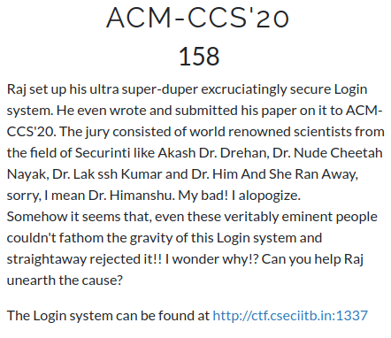

# CsecIITB CTF 2020
## Category: Web
## Challenge: ACM-CSS'20
## Points: 500
### Description:




### Idea: 

On first seeing the page the question appear to has something to do with JS. For web question to inspect the elements is always an good start. In console there is warning about password also. This is a question of client side validation.

On exploring we found that there is a file `svg.js` that is using the password field in some comparisons. For a website to compare the password in JS make them vulnerable to attacks. So mostly what websites do is to send a request and interpret its response.

Let us look closely `svg.js`

```
1  window.onload = (event) => {
2     var f = document.querySelector("form")
3     f.addEventListener('submit', function(e){
4        e.preventDefault()
5        var u = f.elements[0].value
6        var oohlala = f.elements[1].value
7        var p = ""
8        for (var i=0;i<oohlala.length-1;i++){
9            p += String.fromCharCode( oohlala.charCodeAt(i)-1 )
10        }
11        if (u === "imdadmin" && CryptoJS.MD5(p).toString() === "43dd944fa710dbe290fd7b118b7da76e"){
12            if (oohlala[oohlala.length-1] === "@"){
13                document.location = document.location.href+"/../"+oohlala+".htm"
14            }
15        }
16        else{
17            document.getElementById('r').innerHTML = "Wrong Username or Password!"
18        }
19    })
20 }

```
Start form line:5, here "u" stores the user name and "oohlala" stores the password. The next loop is storing predecessor alphabet of each char in "oohlala" except the last one. If we pass the next if statement we will be redirected to the flag page. From if condition it is clear the "u=imdadmin". The next condition is encrypting "p" with md5 and then comparing to the hex. What we need to do is decrypt the hex and get what p is then every char of "oohlala" will be successor of corresponding index char of p. 

Decrypting is not an easy job. But few websites store the string and their encryptions. When a query is made they just return the corresponding string to the hex. On decrypting the hash from [here](https://www.md5online.org/md5-decrypt.html) we get "rishabhraj".
Which means p="rishabhraj", therfore oohlala="sjtibcisbk". As the last condition says we have to append '@', so finally oohlala="sjtibcisbk@". 

*Flag*
> CSecIITB{Client_S1de_Val1dati0n?Are_y0u_k1dd1ng_me?}


