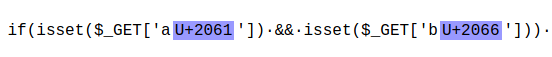

# CsecIITB CTF 2020
## Category: Web
## Challenge: ACM-CSS'20
## Points: 500
### Description:

> Feeling Cute Might Delete :P
My cuteness can be accessed at http://ctf.cseciitb.in:2337

### Idea: 
On first glance the code appear to be taking only two arguments from the url i.e. "a" and "b". So we can get the flag by forming non-empty query like `ctf.cseciitb.in:2337/?a='1'&b='1'`. But nothing come out. To see where the code failed copy everything to local
and put some statements to track. The following is the code after adding statements,

```
<?php
$flag="hi";

if(isset($_GET['a']) && isset($_GET['b']))
{
    $a = $_GET['a'];
    $b = $_GET['b'];
 	var_dump($a);
	var_dump($b);
    if (!empty($a) && !empty($b))
    {
        if($a===$b)
        {
	    var_dump($a);
	    var_dump($b);
	    var_dump(isset($_GET['a']) && isset($_GET['b'])); //self written [1]
	    var_dump(isset($_GET['a⁡']) && isset($_GET['b⁦'])); // copy paste from the block [2]
            if(isset($_GET['a⁡']) && isset($_GET['b⁦']))
            {	
                $a = $_GET['a⁡'];
                $b = $_GET['b⁦'];
                if($a!==$b)
                {
                    die($flag);
                }

                else{
                    echo "5 a!=b";
                }
		
            }
            
            else{
	            echo "4 again isset";
	        }
		
        }
        
        else{
	        echo "3 a===b checking";
	    }
	
    }
	else{
	    echo "2 empty checking";
    }
	
} 
else {
    echo "1 the outermost";
}

```
On making a request we found that $[1]$ gives "bool(true)" and $[2]$ gives "bool(false)". Strange!
It means that "a" and "b" in next if are different. To see this we went to [here](https://www.soscisurvey.de/tools/view-chars.php)
and paste the code block from the original site and found .

So we need to make a request such that there are four arguments "a", "b", "aU+2061" and "bU+2066". 
`ctf.cseciitb.in:2337/?a='1'&b='1'&a⁡='1'&b⁦='2'` (for the other a and b just copy from the page) gives us the flag.

*Flag :*
> CsecIITB{Meri_bhaisa_ko_2_bar_anda_kisne_maari!}