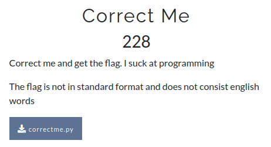

# CsecIITB CTF 2020
## Category: Reverse Engineering
## Challenge: Correct Me
## Points: 500
### Description:



### Idea:

The program given was,

```
#In the following program, *all* uppercase strings must be replaced by the correct strings to make it work.

1 from BBBBBBB import AAA
2 from this import Z as zen
3
4 def solve(challenge):
5     words = zen.YYYYY()
6     unique = XXX(words)
7     if WWW(unique) == 96:
8         msg = 'WWW' + 'XXX' + 'YYYYY' + challenge + 'Z'
9         hidden = AAA(msg.encode())
10        return getattr(hidden, 'tsegidxeh'[::-1])()
11   else:
12        raise 'Wrong'

13 flag = solve('7f/dd')
```
Lets us try to see the possibilities of replacement. In line 10 the second argument in the getattr() function is 'tsegidxeh'[::-1]='hexdigest'. That means in line 9 some hashing algorithm is used. Hashing algorithms are in 'hashlib' library of python. So we got one replacement BBBBBBB="hashlib". If you see docs of hashlib you will find that only 'md5' is one with 3 chars. So now AAA='md5'. Now what is zen. After googling I found that library "this" has some zen quotes. I you dig deeper in that you will found that there is a constant 's' that is decrypted with ROT3 and we get the zen quotes. So now Z='s'. See line 6 there is something with unique, so XXX must be 'set' which gives WWW='len'. 'zen' is a long string so to split it in words 'split()' must has been used. So YYYYY='split'. Everything is in place now. Replace them and the flag.

*Flag :*
> 834757e5460533148559d9ecd5b91b70