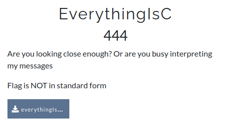

# CsecIITB CTF 2020
## Category: Reverse Engineering
## Challenge: EverythingIsC
## Points: 500
### Description:


Program available in repo.

### Idea:
The given file is compiled version of a python code. We need to first get the source code by decompiling it. Later we will see what is in the code. Since it is 500 points challenge what is inside the code is not going to be straight copy paste.

For decompiling there are many online tools or you can use python library **Uncompyle6** to run errands for you. After decompiling the source code we get is:

```
import random
try:
    passw = int(input('Password:')) ^ random.randint(1, 255)
    if bytes([i ^ passw for i in b'*\r\x17P\x11\x13\x11P\x17P\x07<\nV<PWV\x1a<\x02\x10<+&////////']).hex() == '63445e19585a58195e194e75431f75191e1f53754b5975626f6666666666666666':
        print('You Got the idea, now get the flag ;)')
    else:
        print('tch tch tch, pathetic')
except:
    print('tch tch tch, pathetic')

```

What is happening over here, we will enter some password, xor of that is taken with a random integer from 1 to 255. The obtained quantity's xor is taken with every char's byte in the string. We will obtain a series of bytes that is encoded in hex and compared. 

Put the hex "63445e19585a58195e194e75431f75191e1f53754b5975626f6666666666666666" in `Rapid Tables` and get the bytes corresponding to it here "99, 68, 94, 25, 88, 90, 88, 25, 94, 25, 78, 117, 67, 31, 117, 25, 30, 31, 83, 117, 75, 89, 117, 98, 111, 102, 102, 102, 102, 102, 102, 102, 102". As we can see the 102 and '/' both are repeating at the tail. As we know a^b^b (^ is xor ) is a. So if I xor 102 with bytes('/') I can get what was pwd. 

"pwd" come out to be 73. Now we need to find the password which when taken xor with the string can give us the flag. 

If we xor a random int with 73 we can get back the password. But which integer. Lets us check all from 1 to 255, our assumption is when we xor the password thus obtained with the bytes of each char of the string will get one relevant string rest will be gibberish. For ease I converted the string in bytes form prior to feeding in this program,

```
passw=73
b=[42, 13, 23, 80, 17, 19, 17, 80, 23, 80, 7, 60, 10, 86, 60, 80, 87, 86, 26, 60, 2, 16, 60, 43, 38, 47, 47, 47, 47, 47, 47, 47, 47]

f=open("test.txt", 'w')
for i in range(1,255):
	c=""
	p=i^passw
	for j in b:
		c+=chr(j^p)
	f.write(c+'\n')

f.close()
 
```
Run your eyes through obtained strings, you will get the flag.

*Flag :*
> Int3rpr3t3d_i5_345y_as_HELLLLLLLL