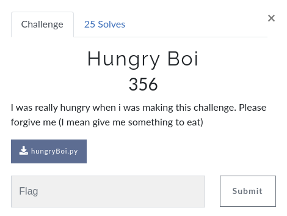

# CsecIITB CTF 2020

## Category: Reverse Engineering

## Challenge: Hungry Boi



Given this python [script](hungryBoi.py), we have to reverse it and figure out the password.
The source code -

```python

EAT = int
eAT = len
EaT = print
ATE = str
EATEATEATEATEATEAT = ATE.isdigit

def Eating(eat):
    return ATE(EAT(eat)*EATEATEAT)

def EAt(eat, eats):
    print(eat, eats)
    eat1 = 0
    eat2 = 0
    eateat = 0
    eAt = ""
    while eat1 < eAT(eat) and eat2 < eAT(eats):
        if eateat%EATEATEAT == EATEATEATEATEAT//EATEATEATEAT:
            eAt += eats[eat2]
            eat2 += 1
        else:
            eAt += eat[eat1]
            eat1 += 1
        eateat += 1
    return eAt

def aten(eat):
    return eat[::EATEATEAT-EATEATEATEAT]

def eaT(eat):
    return Eating(eat[:EATEATEAT]) + aten(eat)

def aTE(eat):
    return eat#*eAT(eat)

def Ate(eat):
    return "Eat" + ATE(eAT(eat)) + eat[:EATEATEAT]

def Eat(eat):
    if eAT(eat) == 9:
        if EATEATEATEATEATEAT(eat[:EATEATEAT]) and\
            EATEATEATEATEATEAT(eat[eAT(eat)-EATEATEAT+1:]):
                eateat = EAt(eaT(eat), Ate(aTE(aten(eat))))
                if eateat == "E10a23t9090t9ae0140":
                    flag = "eaten_" + eat
                    EaT("absolutely EATEN!!! CsecIITB{"+flag+"}")
                else:
                    EaT("thats not the answer. you formatted it fine tho, here's what you got\n>>", eateat)
        else:
            EaT("thats not the answer. bad format :(\
            \n(hint: 123abc456 is an example of good format)")
    else:
        EaT("thats not the answer. bad length :(")

EaT("what's the answer")
eat = input()
EATEATEAT = eAT(eat)//3
EATEATEATEAT = EATEATEAT+1
EATEATEATEATEAT = EATEATEAT-1
Eat(eat)
```

```interactive
> python3 hungryBoi.py
what's the answer
ahgsdalk
thats not the answer. bad length :(
```

Let's read up the file and try to reverse it.
Many functions and variables having names related to `eat` wtf!

The first check is a length check - the length should be `9`. `eat` is our password and thus, `eAT(eat)` is `9` so we have -

``` python
EATEATEAT = eAT(eat)//3( = 3)
EATEATEATEAT = EATEATEAT+1( = 4)
EATEATEATEATEAT = EATEATEAT-1(= 2)
```

And then, heading on to the format check -

``` python
if EATEATEATEATEATEAT(eat[:EATEATEAT]) and\
    EATEATEATEATEATEAT(eat[eAT(eat)-EATEATEAT+1:]):
```

And we have `EATEATEATEATEATEAT = ATE.isdigit = str.isdigit` checks if the string has only digits, the first condition checks the first 3 letters(`[:EATEATEAT(=3)]`) and the second checks the last 3 letters(`[eAT(eat)-EATEATEAT+1(=9-3+1=7):]`), thus our password should have the format - `3 digits || 3 characters || 3 digits`(`||` denotes concatenation).

Let's put in the values for all functions and variables -

```python
def Eating(eat):
    return str(int(eat)*3)
#this function takes the string representation of int, and returns the string representation of thrice the int

def aten(eat):
    return eat[::3-4]
#this function reverses the input string

def eaT(eat):
    return Eating(eat[:3]) + aten(eat)
#take the top 3 digits, concatenate thrice of the number with the reverse of the input

def aTE(eat):
    return eat#*len(eat)
#just returns the string, dayum

def Ate(eat):
    return "Eat" + str(len(eat)) + eat[:3]
#returns "Eat" concat length of string concat the first 3 digits

def EAt(eat,eats):
    print(eat, eats)
    eat1 = 0
    eat2 = 0
    eateat = 0
    s = ""
    while eat1 < len(eat) and eat2 < len(eats):
        if eateat%3 == 2//4:
            s += eats[eat2]
            eat2 += 1
        else:
            s += eat[eat1]
            eat1 += 1
        eateat += 1
    return s
#this function takes two strings, and appends one char from second string followed by two from first string, and goes on until one of the string(s) becomes empty.
```

Now we want to clear the last check -

```python
eateat = EAt(eaT(eat), Ate(aTE(aten(eat))))
if eateat == "E10a23t9090t9ae0140":
    flag = "eaten_" + eat
    EaT("absolutely EATEN!!! CsecIITB{"+flag+"}")
```

`eat` has length 9, `aten` reverses it, `aTE` just returns the input, `Ate` will then return "Eat9" concat last 3 digits of `eat` reversed, and `eaT` returns thrice of top 3 digits + reverse of string.

Interleaving the first and second string, we should get `E10a23t9090t9ae0140` - on de-interleaving(whatever the hell that word means), second string thus begins with `E a t 9 9 0 0` and first string begins with `10 23 90 0t ae 14`. Therefore, thrice of top 3 digits is `1023` and thus, top 3 digits are `341`, `900tae14` is some prefix of reversed password, thus the password must be `341eat009` and our flag should be `CsecIITB{eaten_341eat009}`. Easy peasy lemon squeezy.

``` interactive
> python3 hungryBoi.py
what's the answer
341eat009
1023900tae143 Eat9900
absolutely EATEN!!! CsecIITB{eaten_341eat009}
```

:wink:
