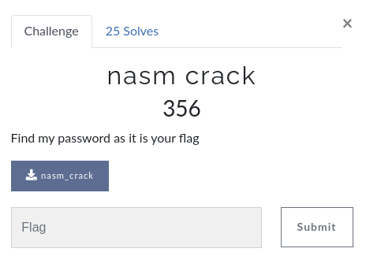

# CsecIITB CTF 2020

## Category: Reverse Engineering

## Challenge: nasm_crack



We have to find the password to this nasm [file](nasm_crack). Ghidra go brrrrr!

Not worrying too much about anything, we see that our input is compared to the stored passwd which is `supersecret`!

``` interactive
./nasm_crack
Enter your password: supersecret
Correct!
```

Trash chall.
