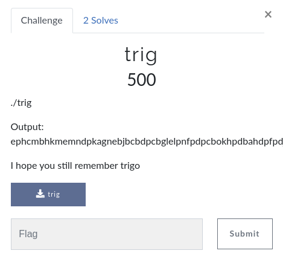

# CsecIITB CTF 2020

## Category: Reverse Engineering

## Challenge: trig



`Output : ephcmbhkmemndpkagnebjbcbdpcbglelpnfpdpcbokhpdbahdpfpdjboemeodpkehfphfbhcdpfmpmbpifdkbeimmdpkjjai`

This is one of the toughest challs I encountered, and damn, it gave me a hell lot of learning(and headache too :P). We're given a stripped 32-bit(i386) [binary](trig), and for some input it gives us the desired output. I personally dislike brute-forcing and since assembly is new stuff for me, I already feel like learning it.

```bash
> file trig
trig: ELF 32-bit LSB executable, Intel 80386, version 1 (SYSV), dynamically linked, interpreter /lib/ld-linux.so.2, BuildID[sha1]=be9f9521d9010aa32e53457121ba102647593600, stripped

> ./trig 0
dpgidagcopmmdpoemdmjnhgacpefdefhgfbpdphdehmafmpndpdhbecjbjdkdpfflihfhjpmdppgngdoglfdbebndbdnhfam
```

Stripped binary, smells like difficult stuff. Fire up Ghidra and it shits in your face :(

```c

void entry(undefined4 param_1,int param_2)

{
  code *pcVar1;
  uint uVar2;
  undefined4 uVar3;
  undefined4 uVar4;
  uint *puVar5;
  int iVar6;
  float10 fVar7;
  float10 fVar8;
  float10 fVar9;
  float10 fVar10;
  float10 fVar11;
  float10 fVar12;
  float10 fVar13;
  
  uVar4 = *(undefined4 *)(param_2 + 0x18);
  uVar3 = *(undefined4 *)(param_2 + 0x1c);
  uVar2 = *(uint *)(param_2 + 0x20);
  *(undefined4 *)(param_2 + 0x20) = 0x3fff00;
  *(uint *)(param_2 + 0x1c) = uVar2;
  puVar5 = (uint *)(param_2 + 0x18);
  *(undefined4 *)(param_2 + 0x18) = 0x80808080;
  fVar7 = (float10)fcos((float10)*(double *)(param_2 + 0x1b));
  *(undefined4 *)(param_2 + 0x1c) = uVar3;
  fVar8 = (float10)fcos((float10)*(double *)(param_2 + 0x1b));
  *(undefined4 *)(param_2 + 0x1c) = uVar4;
  fVar9 = (float10)fcos((float10)*(double *)(param_2 + 0x1b));
  *(undefined4 *)(param_2 + 0x1c) = *(undefined4 *)(param_2 + 0x14);
  fVar10 = (float10)fcos((float10)*(double *)(param_2 + 0x1b));
  *(undefined4 *)(param_2 + 0x1c) = *(undefined4 *)(param_2 + 0xc);
  fVar11 = (float10)fcos((float10)*(double *)(param_2 + 0x1b));
  *(undefined4 *)(param_2 + 0x1c) = *(undefined4 *)(param_2 + 8);
  fVar12 = (float10)fcos((float10)*(double *)(param_2 + 0x1b));
  *(undefined4 *)(param_2 + 0x1c) = *(undefined4 *)(param_2 + 4);
  fVar13 = (float10)fcos((float10)*(double *)(param_2 + 0x1b));
  *(double *)(param_2 + 0x1e) = (double)fVar13;
  *(double *)(param_2 + 0x24) = (double)fVar12;
  *(double *)(param_2 + 0x2a) = (double)fVar11;
  *(double *)(param_2 + 0x30) = (double)fVar10;
  *(double *)(param_2 + 0x36) = (double)fVar9;
  *(double *)(param_2 + 0x3c) = (double)fVar8;
  *(double *)(param_2 + 0x42) = (double)fVar7;
  *(double *)(param_2 + 0x16) = (double)*(int *)(param_2 + 0x10);
  iVar6 = 0x30;
  while (iVar6 += -1, -1 < iVar6) {
    uVar2 = ((uVar2 & 0xffffff00 | (uint)*(byte *)((int)puVar5 + iVar6)) & 0xffffff0) << 4;
    puVar5[-1] = uVar2 & 0xffff0000 |
                 (uint)(ushort)((((ushort)uVar2 | (ushort)*(byte *)((int)puVar5 + iVar6)) & 0xf0f) +
                               0x6161);
    pcVar1 = (code *)swi(0x80);
    (*pcVar1)();
    uVar2 = *puVar5;
    puVar5 = puVar5 + 1;
  }
  puVar5[-1] = 10;
  pcVar1 = (code *)swi(0x80);
  (*pcVar1)();
  pcVar1 = (code *)swi(0x80);
  (*pcVar1)();
                    /* WARNING: Bad instruction - Truncating control flow here */
  halt_baddata();
}
```

Seems like dis-assembling is the task here. Note that ghidra only shows one function named `entry`, no `main` hmmmmm :thinking:. Stripping a binary literally leaves no names in there, not even `main` lol.

```assembly
                             undefined __cdecl entry(undefined4 param_1, int param_2)
             undefined         AL:1           <RETURN>
             undefined4        Stack[0x4]:4   param_1
             int               Stack[0x8]:4   param_2                                 XREF[1]:     08048151(*)  
                             entry                                           XREF[3]:     Entry Point(*), 08048018(*), 
                                                                                          _elfSectionHeaders::000000fc(*)  
        0804814f 58              POP        EAX
        08048150 58              POP        EAX
        08048151 5c              POP        ESP=>param_2
        08048152 db 44 24 0c     FILD       dword ptr [ESP + 0xc]
        08048156 61              POPAD
        08048157 68 00 ff        PUSH       0x3fff00
                 3f 00
        0804815c 50              PUSH       EAX
        0804815d 68 80 80        PUSH       0x80808080
                 80 80
        08048162 dd 44 24 03     FLD        qword ptr [ESP + 0x3]
        08048166 d9 ff           FCOS
        08048168 89 4c 24 04     MOV        dword ptr [ESP + 0x4],ECX
        0804816c dd 44 24 03     FLD        qword ptr [ESP + 0x3]
        08048170 d9 ff           FCOS
        08048172 89 54 24 04     MOV        dword ptr [ESP + 0x4],EDX
        08048176 dd 44 24 03     FLD        qword ptr [ESP + 0x3]
        0804817a d9 ff           FCOS
        0804817c 89 5c 24 04     MOV        dword ptr [ESP + 0x4],EBX
        08048180 dd 44 24 03     FLD        qword ptr [ESP + 0x3]
        08048184 d9 ff           FCOS
        08048186 89 6c 24 04     MOV        dword ptr [ESP + 0x4],EBP
        0804818a dd 44 24 03     FLD        qword ptr [ESP + 0x3]
        0804818e d9 ff           FCOS
        08048190 89 74 24 04     MOV        dword ptr [ESP + 0x4],ESI
        08048194 dd 44 24 03     FLD        qword ptr [ESP + 0x3]
        08048198 d9 ff           FCOS
        0804819a 89 7c 24 04     MOV        dword ptr [ESP + 0x4],EDI
        0804819e dd 44 24 03     FLD        qword ptr [ESP + 0x3]
        080481a2 d9 ff           FCOS
        080481a4 dd 5c 24 06     FSTP       qword ptr [ESP + 0x6]
        080481a8 dd 5c 24 0c     FSTP       qword ptr [ESP + 0xc]
        080481ac dd 5c 24 12     FSTP       qword ptr [ESP + 0x12]
        080481b0 dd 5c 24 18     FSTP       qword ptr [ESP + 0x18]
        080481b4 dd 5c 24 1e     FSTP       qword ptr [ESP + 0x1e]
        080481b8 dd 5c 24 24     FSTP       qword ptr [ESP + 0x24]
        080481bc dd 5c 24 2a     FSTP       qword ptr [ESP + 0x2a]
        080481c0 dd 5c 24 fe     FSTP       qword ptr [ESP + -0x2]
        080481c4 bb 01 00        MOV        EBX,0x1
                 00 00
        080481c9 8d 4c 24 fc     LEA        ECX,[ESP + -0x4]
        080481cd ba 02 00        MOV        EDX,0x2
                 00 00
        080481d2 bf 30 00        MOV        EDI,0x30
                 00 00
                             LAB_080481d7                                    XREF[1]:     080481f4(j)  
        080481d7 4f              DEC        EDI
        080481d8 78 1c           JS         LAB_080481f6
        080481da 8a 04 3c        MOV        AL,byte ptr [ESP + EDI*0x1]
        080481dd c1 e0 04        SHL        EAX,0x4
        080481e0 8a 04 3c        MOV        AL,byte ptr [ESP + EDI*0x1]
        080481e3 66 25 0f 0f     AND        AX,0xf0f
        080481e7 66 05 61 61     ADD        AX,0x6161
        080481eb 50              PUSH       EAX
        080481ec b8 04 00        MOV        EAX,0x4
                 00 00
        080481f1 cd 80           INT        0x80
        080481f3 58              POP        EAX
        080481f4 eb e1           JMP        LAB_080481d7
                             LAB_080481f6                                    XREF[1]:     080481d8(j)  
        080481f6 b8 04 00        MOV        EAX,0x4
                 00 00
        080481fb ba 01 00        MOV        EDX,0x1
                 00 00
        08048200 6a 0a           PUSH       0xa
        08048202 cd 80           INT        0x80
        08048204 58              POP        EAX
        08048205 b8 01 00        MOV        EAX,0x1
                 00 00
        0804820a 31 db           XOR        EBX,EBX
        0804820c cd 80           INT        0x80
```

Overview time -

```assembly
        0804814f 58              POP        EAX
        08048150 58              POP        EAX
        08048151 5c              POP        ESP=>param_2
```

Hope you know what's [gdb](https://www.gnu.org/software/gdb/), and hope you also use [gef](https://gef.readthedocs.io/en/master/) plugin with it.

We will begin reversing this awesome looking assembly code - took me hours, but can be done in less than 50 minutes :grin:
Note - all usual registers are `32 bits` in `i386` architecture, memory is little-endian, and assembly is OP :smile:

Let's also have a look at how the arguments are put in stack -


Thus, initially, `esp` points to the number of arguments(`2` since the absolute address to the binary is also considered as an argument) and after the first 3 instructions are executed, `esp` now contains the memory address of the input argument. Also please note that even though we do control the environment variables, here I'd only rather tweak the input string so that the intermediate null bytes don't cause any trouble. If you didn't quite understand my previous statement, what I mean is that the input string would be long enough.

```assembly
        08048152 db 44 24 0c     FILD       dword ptr [ESP + 0xc]
```

`FILD` is an FPU instruction from the [x87](https://en.wikipedia.org/wiki/X87) instruction set. I found some good references for the FPU here - [1](https://cs.fit.edu/~mmahoney/cse3101/float.html), [2](https://www.felixcloutier.com/x86/index.html).

`dword ptr` works with 32 bits at a time while `qword ptr` works with 64 bits, independent of whether the arch is 32-bit or 64-bit.

For floating point calculations, the architecture has another FPU register stack which contains 8 80-bit registers named `st(0)` to `st(7)` and it uses different instructions unlike `mov,add` etc. `st(0)` represents the top of the stack, and this is where anything is loaded from memory. If `st(0)` is not empty, and a push is being made to the stack, the value present in `st(0)` is moved to `st(1)` if that register is empty and so on, and the new value is then put into `st(0)`. 

`FILD` instruction interprets the passed argument as an integer, and converts it into float which is then pushed to the stack. Thus, using python convention, `s[12:16]` (where `s` denotes our input string, pointed to by `esp`) is read as an integer(don't forget little-endian :P), converted to float and then put into `st(0)`, which was empty earlier. 

```assembly
        08048156 61              POPAD
```

Next comes a `POPAD` instruction - this instruction pops values from the stack into all general-purpose registers in the order `edi,esi,ebp,nothing,ebx,edx,ecx,eax` where nothing means that this place was there for `esp` but we didn't pop into `esp`. Also note that after every pop, `esp` increases by 4, because after all `esp` points to the top of the stack, so popping simply means that `esp` moves forward - note that the stack is reversed over here as shown below, `esp` points to a lower address wrt `ebp`.

```
     XXXXXXXXXXX
(top)|         |(bottom)
    esp       ebp
```

Splitting up our string into blocks of 4 chars, we can see what's happening -

```
s : XXXX  XXXX  XXXX  XXXX  XXXX  XXXX  XXXX  XXXX  32
    |  |  |  |  |  |  |  |  |  |  |  |  |  |  |  |  ^
    ----  ----  ----  ----  ----  ----  ----  ----  |
    edi   esi   ebp   none  ebx   edx   ecx   eax  esp
    0:4   4:8   8:12  12:16 16:20 20:24 24:28 28:32
```

We mustn't forget that memory is little-endian and since we're essentially moving blocks of 4, we should be careful about endianness , so the values stored in the registers would be reversed.
Thus, at the end, `esp` points to `s[32]` and the registers store several blocks of the string.

```assembly
        08048157 68 00 ff        PUSH       0x3fff00
                 3f 00
        0804815c 50              PUSH       EAX
        0804815d 68 80 80        PUSH       0x80808080
                 80 80
```

We're pushing some values to the stack! So our stack now looks like follows - 

```
    stack ->
    80 80 80 80 X X X X 00 ff 3f 00
    ^           -------
    |           eax value
    esp
```

The eax value would be the exact same string as `s[28:32]` and not its reverse, because push is exactly the reverse of pop! Thus, for the moment, we shouldn't concerned about reversing things.

```assembly
        08048162 dd 44 24 03     FLD        qword ptr [ESP + 0x3]
        08048166 d9 ff           FCOS
```

`FLD` takes the 8-byte chunk(remember `qword` is 8 bytes) beginning from `esp+0x3`, converts it to [extended double](https://en.wikipedia.org/wiki/Extended_precision) and pushes it to the `st` stack.
The 8-byte chunk is given by(refer to the stack shown above) `80 X1 X2 X3 X4 00 ff 3f`, which is in qword terms -`0x3fff00(X4)(X3)(X2)(X1)80` where every `X` denotes a byte. Note that this hex value is 8 bytes(64 bits) long `double`.

We'd need to look up how is a `double` represented, google go brrrrr - [Double Precision Format](https://en.wikipedia.org/wiki/Double-precision_floating-point_format).

Consider a 64-bit `double` ->

```
    X    XXXXXXXXXXX    XXXXXXXXXXXXXXXXXXXXXXXXXXXXXXXXXXXXXXXXXXXXXXXXXXXX
    |         |                                  |
   sign    exponent                           fraction
  1 bit    11 bits                             52 bits
```

This is not all :) The exponent is [biased](https://en.wikipedia.org/wiki/Exponent_bias) by `1023`. What this means is that suppose the 11-bit exponent value turns out to be `1023`, then this would mean that its exponent is actually zero. Moreover, `double` format has implied `1` - that is, the mantissa is equal to `1 . fraction` where every digit is in base 2. The sign bit being set signifies negative number. We would come back to the value of this float(and more) in just a minute!

The `FCOS` instruction is after all, the reason why this program is named `trig` :grin:
This instruction computes the cosine of the value in the register `st(0)` in radians, and stores the result back in `st(0)`.

```assembly
        08048168 89 4c 24 04     MOV        dword ptr [ESP + 0x4],ECX
        0804816c dd 44 24 03     FLD        qword ptr [ESP + 0x3]
        08048170 d9 ff           FCOS
        08048172 89 54 24 04     MOV        dword ptr [ESP + 0x4],EDX
        08048176 dd 44 24 03     FLD        qword ptr [ESP + 0x3]
        0804817a d9 ff           FCOS
        0804817c 89 5c 24 04     MOV        dword ptr [ESP + 0x4],EBX
        08048180 dd 44 24 03     FLD        qword ptr [ESP + 0x3]
        08048184 d9 ff           FCOS
        08048186 89 6c 24 04     MOV        dword ptr [ESP + 0x4],EBP
        0804818a dd 44 24 03     FLD        qword ptr [ESP + 0x3]
        0804818e d9 ff           FCOS
        08048190 89 74 24 04     MOV        dword ptr [ESP + 0x4],ESI
        08048194 dd 44 24 03     FLD        qword ptr [ESP + 0x3]
        08048198 d9 ff           FCOS
        0804819a 89 7c 24 04     MOV        dword ptr [ESP + 0x4],EDI
        0804819e dd 44 24 03     FLD        qword ptr [ESP + 0x3]
        080481a2 d9 ff           FCOS
```

Notice the similarity in the instructions :stuck_out_tongue: Also, note that our `eax` value was put at current `esp+0x4`, that's exactly where the data from other registers is being moved to! And then we're computing cosine of the same.

But whose cosine are we computing? The values in hex is - `0x3fff00(X4)(X3)(X2)(X1)80`. Let's split up this hexadecimal number -

```
|     3    |   f   |   f    |    f   |   0   |   0   | X4 X3 X2 X1 |   8   |    0   |
| 0 | 0 1 1 1 1 1 1 1 1 1 1 | 1 1 1 1 0 0 0 0 0 0 0 0  --32 bits--  1 0 0 0 0 0 0 0 |
  |   |                   |   |                                                   |
sign  ---------------------   -----------------------------------------------------
bit     exponent bits(11)                       fraction bits(52)
```

Sign bit is `0` - that is, our fraction is positive. Exponent bits can be calculated to be `1023` ,that is, the exponent is `0`(bias of `1023`). Fraction bits amount to -`f/16 + X / 16^11 + 8/16^12` since each bit in fraction contributes a value equal to that bit divided by `2^i` where i is the bit number from left, considering 1-indexing, that is, if fraction is `101` then its value is -`1/2^1 + 0/2^2 + 1 /2^3`, and similarly every block of 4 bits amounts to 16 and a byte amounts to 256. Therefore, the fraction would be(not forgetting the implied 1) - `1 + f/16 + X / 16^11 + 8/16^12` where `X` denotes the bytes `X4 X3 X2 X1` interpreted as an integer(4 bytes long).

If we consider the instruction `08048168 89 4c 24 04     MOV        dword ptr [ESP + 0x4],ECX`, this means that `X` is the characters in `ecx` in the reverse order - that is, since `ecx` stores `s[24:28]`, X is the reverse of the same, and the cosine of this would be stored in `st(0)`. Note that `FLD` instruction does a push, and not just a move - therefore, the earlier values are shifted downwards - since `st` stack has 8 registers, and we're pushing to the stack 8 times - once the integer values using `FILD` and 7 times the various registers - the stack is now full, and stores the following -

```
st(0) -> edi - s[0:4]
st(1) -> esi - s[4:8]
st(2) -> ebp - s[8:12]
st(3) -> ebx - s[16:20]
st(4) -> edx - s[20:24]
st(5) -> ecx - s[24:28]
st(6) -> eax - s[28:32]
st(7) -> integer value of s[12:16]
```

where every register denotes that the fraction was calculated using that register in place of `X`.

```assembly
        080481a4 dd 5c 24 06     FSTP       qword ptr [ESP + 0x6]
        080481a8 dd 5c 24 0c     FSTP       qword ptr [ESP + 0xc]
        080481ac dd 5c 24 12     FSTP       qword ptr [ESP + 0x12]
        080481b0 dd 5c 24 18     FSTP       qword ptr [ESP + 0x18]
        080481b4 dd 5c 24 1e     FSTP       qword ptr [ESP + 0x1e]
        080481b8 dd 5c 24 24     FSTP       qword ptr [ESP + 0x24]
        080481bc dd 5c 24 2a     FSTP       qword ptr [ESP + 0x2a]
        080481c0 dd 5c 24 fe     FSTP       qword ptr [ESP + -0x2]
        080481c4 bb 01 00        MOV        EBX,0x1
                 00 00
        080481c9 8d 4c 24 fc     LEA        ECX,[ESP + -0x4]
        080481cd ba 02 00        MOV        EDX,0x2
                 00 00
        080481d2 bf 30 00        MOV        EDI,0x30
                 00 00
                                              LAB_080481d7                                    XREF[1]:     080481f4(j)  
        080481d7 4f              DEC        EDI

```

`FSTP` instruction stores the value in `st(0)` to the provided memory location, and then pops the stack.(We needn't too much bothered about the extended double to double conversion here I think.) The memory locations where the data is put are overlapping as can be seen over here -

```
|X X X X|X X X X|X X X X|X X X X|X X X X|X X X X|X X X X| ... |X X X X|X X X X|X X X X|
     ^   ^         ^ ^           ^ ^ ^         ^          more     ^         ^   ^
     |   |         | |           | | |         |         blocks    |         |   |
    esp esp        |esp         esp|esp        |                  esp       esp  |
     -             | +           + | +         |                   +         +   |
    0x2            |0x6         0xc|0xe        |                  0x2a       47  |
     |             | |           | |           |                   |             |
     --------------- ------------|--           |                   ---------------
      from s[12:16]     from edi ---------------                      from eax
                                    from esi
```

So the last two bytes are either over-written(for all registers but `eax`) or are not even accessed(for `eax`, as we'll see soon). However, no worries :) First of all, these are the sign and exponent bits and some top bits of the fraction. Now, since we know that our fraction can only range from say, loosely, `1 + (15/16)` to `2`, this being in the second quadrant, the cosine function is monotonice and so we'd know the range for cosine values, which should provide us with the necessary info! These were some talks about the values obtained from registers, what about the one which was loaded as integer initially?

This is the best part man, the integer was 4 bytes long, so it would not suffer from any round-off errors, it would simply be put into the extended double format, and then is exported to memory in the double format! The value is the same, only the format is what matters right? Cool! We're almost done with the chall!

As you can see at the end, `ebx` is set to `1`, `lea` instruction takes the address from the right argument, and puts it in the left one, thus `ecx` is set to `esp-0x4`, `edx` to `2`, and `edi` to `48`, just after which it is decremented to `47`.

```assembly
        080481d8 78 1c           JS         LAB_080481f6
        080481da 8a 04 3c        MOV        AL,byte ptr [ESP + EDI*0x1]
        080481dd c1 e0 04        SHL        EAX,0x4
        080481e0 8a 04 3c        MOV        AL,byte ptr [ESP + EDI*0x1]
        080481e3 66 25 0f 0f     AND        AX,0xf0f
        080481e7 66 05 61 61     ADD        AX,0x6161
        080481eb 50              PUSH       EAX
        080481ec b8 04 00        MOV        EAX,0x4
                 00 00
        080481f1 cd 80           INT        0x80
        080481f3 58              POP        EAX
        080481f4 eb e1           JMP        LAB_080481d7
                             LAB_080481f6                                    XREF[1]:     080481d8(j)  
        080481f6 b8 04 00        MOV        EAX,0x4
                 00 00
        080481fb ba 01 00        MOV        EDX,0x1
                 00 00
        08048200 6a 0a           PUSH       0xa
        08048202 cd 80           INT        0x80
        08048204 58              POP        EAX
        08048205 b8 01 00        MOV        EAX,0x1
                 00 00
        0804820a 31 db           XOR        EBX,EBX
        0804820c cd 80           INT        0x80
```

`JS` jumps to the mentioned address `LAB_080481f6` if the sign flag is set, which is when the previous decrement is from `0` to `-1`, that is, when the coming loop has been executed `48` times. What's in the loop? `MOV AL, byte ptr [ESP + EDI*0x1]` - take the byte from the memory at location `esp+edi`, move it to `al`(`al` refers to the lowest 8 bits of the register `eax`), then shift this left by 4 bits (`SHL EAX, 0x4`). `eax` probably had some value earlier, which was not cleared, man how did they write this binary!!!! Well whatever, let's concentrate on the real stuff happening here. `eax` right now looks like -

```
--------------------eax--------------------
            --------------ax---------------
            ------ah------- ------al-------
--16 bits--|X X X X X X X X|X X X X 0 0 0 0
            ------- |             |
            inital  ---------------
            values  the moved byte
```

Again, `MOV AL,byte ptr [ESP + EDI*0x1]`. This would set `al` to the same byte, thus lower 4 bits of `ah` and higher 4 bits of `al` are the same now. Next, `ax` is "anded" with `0xf0f` which would clear the higher 4 bits of both `ah` and `al`(note that `f` is `1111` thus it does not affect any of the bytes while "anding"). Thus, `ax` now holds the value -`0 0 0 0 --top 4 bits of char-- 0 0 0 0 --bottom 4 bits of char--`. Next up is add `0x6161` to `ax`, which is what it does. Finally, `eax` is pushed to the stack, which means that it would overwrite the value preceding `esp`, and `esp` would be set to `esp-0x4`. Thus, we can see that the lowest 2 bytes of our integer are also gone :( (lowest bcoz little-endian is at it again :). `ecx` thus points to the beginning of our newly-pushed value, since `ecx` was set to `prev esp -0x4` and is not modified later.

Next up is setting up for writing the output, `eax` is set to `0x4`, and then `int 0x80` - syscalllllllllllllllllll hehe. [This wiki](https://en.wikibooks.org/wiki/X86_Assembly/Interfacing_with_Linux) tells you what happens on syscall with the correct args - here `eax` is `0x4` which denotes `write` with the signature `ssize_t write(int fd, const void *buf, size_t count);` - the passed args are `ebx(fd) = 0x1(stdout), ecx(buf) = current esp, edx(count) = 0x2`. Thus, this will write upto 2 bytes beginning from the pointed buffer to stdout, stopping only if it can't write to the output, or the IO has been interrupted(eg if a pipe was closed). Thus, only the top 2 bytes, which correspond to `ax` of `eax`, are written. Then, the top of the stack is popped into `eax`, which doesn't concern us except that `esp` is reverted back to the original one, that is `esp` is set to `current esp + 0x4`. Note that there is now a jump to `LAB_080481d7`, which decreases `edi` and the loop keeps going 48 times in total, thus, 96 bytes are printed. At the end, `eax` is again set to `4`, `edx` to `1`, and now a newline `0xa` is pushed to the stack, `ecx` would again point to the beginning of the pushed value, and again the same syscall, a newline is printed(never forget little-endian or you'll be in trouble :) The last syscall just says `exit 0`.

Hope you got a thorough understanding of assembly, reading up till here. Okay I forgot to mention but the bytes are being printed with higher offsets first. So umm, how should we reverse this whole thing? We first need to divide the output into 6-byte chunks. Let's first reconstruct the memory sequence from the obtained output. Sanitization checks first!
The given output is - `ephcmbhkmemndpkagnebjbcbdpcbglelpnfpdpcbokhpdbahdpfpdjboemeodpkehfphfbhcdpfmpmbpifdkbeimmdpkjjai`, note that it indeed is 96 bytes long. Every 2 bytes correspond to 1 byte of memory - reverse the 2 bytes, subtract `0x6161` from the result, and you should get `0x0X0Y` where `X` and `Y` represent the higher and lower 4 bits of our memory byte respectively - thus `0xXY` would be corresponding memory byte.

Doing this would yield us the memory bytes in reverse order, so reverse the whole damn thing, now we need to recover the overwritten highest 2 bytes of the cosines, hope you remember that we were computing cosine of `1 + f/16 + X/16^11 + 8/16^12` where `X` was 4 bytes long, thus the cosine values can be at max `cos(1+f/16+8/16^12)` and min `cos(1+f/16+(2^32-1)/16^11 + 8/16^12)` (cosine is a decreasing fn in 2nd quadrant - hope you didn't forget your trigo :) - which approximately equal `-0.35854021730625935` and `-0.35876811537858727` in decimal or `0xbfd6f252aae86439` and `0xbfd6f60e8a998273` respectively, thus, we can be sure that the highest 2 bytes of our cosines are `0xbf` and `0xd6` respectively.

We know all the cosine values(`0xbfd6`+ 6 bytes for the register, read from memory in reversed order), we can obtain their arc-cosines, and get the corresponding `X` values, upto some precision errors. This should give us all but the `[12:16]` part of the flag, which we should read from the integer. Also, the order of the values obtained from the registers in the memory is the same as the order in which they were popped into, so no rearranging.

After reversing the whole memory bytes, the first 6 bytes correspond to our integer, also an integer is only 4 bytes(`32 bits`) long, however, when the integer is dumped back into double, the fraction of a double has `52 bits`, implying that the last `20 bits` of the float should rather be zero. `20 bits` is more than `2 bytes`(lowest ones), which we wanted to recover for the integer, making things even easier. This gives us the integer, not forgetting to reverse it after reading it as bytes, and appending it properly to the values obtained from the other sections should give us the flag, or something close to that atleast.

During the competition, we did a lot of guessing to get the flag, but later someone told me about using [gmpy2](http://gmpy2.readthedocs.io/en/latest/), it provides high-precision floating point arithmetic, and so we don't have to worry a lot.

Moreover, no-one wants to write C code for such challs, right? But how do you read a hex value as a double in python then? [struct](https://docs.python.org/3/library/struct.html) to the rescue!

You can find my python [script](trig.py), it has a few comments on where to be careful about endian-ness. Running this script, we get the flag - `CsecIITB{H0p3_y0u_l34rn3d_R1ght}`.

Yeah man, I truly learned a lot. Assembly is OP, and you can't change my mind.